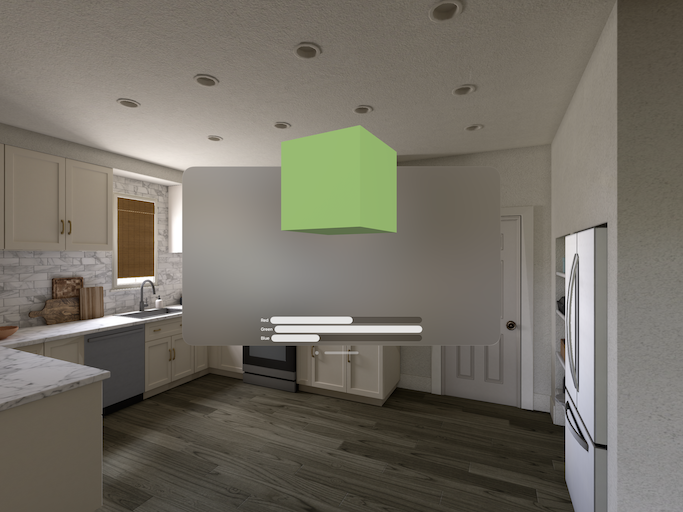

# ShaderGraphControls
Experiments using SwiftUI view and view model to control ShaderGraphNodes in a Reality Composer Pro scene.

We have a Reality Composer Pro scene shwoing a cube with a ShaderGraph material. The cube's 'material is built with a custom ShaderGraph with 3 inputs (red, green, blue). Values for the RCP graph's 'inputs are kept in a View Model. The View updates the View Model, which then updates the RealityView's scene.

The project is meant as a simple demonstration of how to pass values into RCP from SwiftUI while keeping business logic out of the View. This is of course a convoluted way to control the cube's color, but it makes for simple demo code.

See:
 - [WWDC23 Work with Reality Composer Pro content in Xcode](https://developer.apple.com/wwdc23/10273?time=1819)
 - [SO: Controlling parameters in MaterialX](https://stackoverflow.com/a/77705804/719690)
 - [SO: create parameter in Shader Graph](https://stackoverflow.com/a/77844222/719690)
 - [Apple Shader Graph documentation](https://developer.apple.com/documentation/shadergraph)

